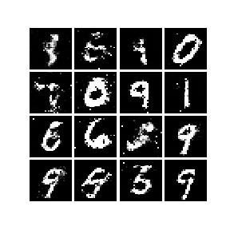
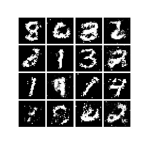
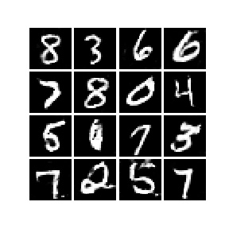
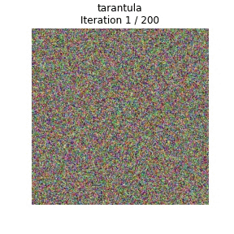
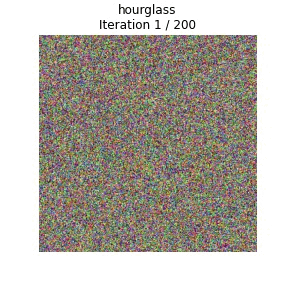
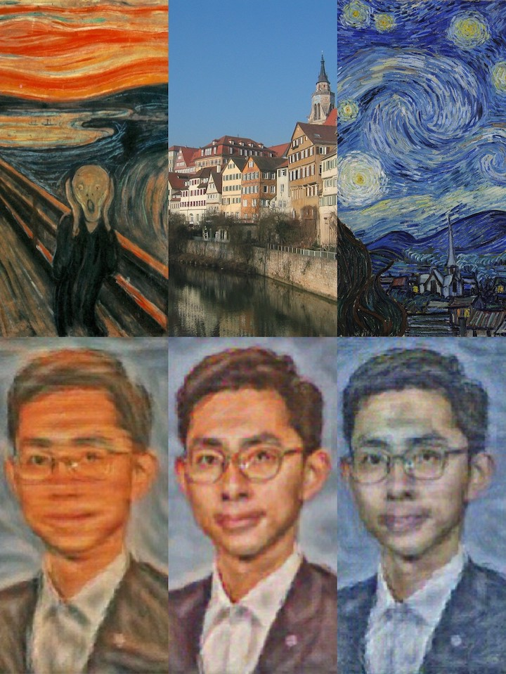

# Deep Learning for Computer Vision

## General Info
Computer Vision has become ubiquitous in our society, with applications in search, image understanding, apps, mapping, medicine, drones, and self-driving cars. Core to many of these applications are visual recognition tasks such as image classification and object detection. Recent developments in neural network approaches have greatly advanced the performance of these state-of-the-art visual recognition systems. This course is a deep dive into details of neural-network based deep learning methods for computer vision. We will cover learning algorithms, neural network architectures, and practical engineering tricks for training and fine-tuning networks for visual recognition tasks.

## Topics
The first half of the course will cover the fundamental components that drive modern deep learning systems for computer vision:
- Linear classifiers
- Stochastic gradient descent
- Fully-connected networks
- Convolutional networks
- Recurrent networks

In the second half of the course we will discuss applications of deep learning to different problems in computer vision, as well as more emerging topics. During this second half the tone of the course will shift slightly towards a seminar: we will omit some details of the systems we discuss, instead focusing on the core concepts behind those applications. We will touch topics such as:
- Attention and transformers
- Object detection
- Image segmentation
- Video classification
- Generative models (GANs, VAEs, autoregressive models)

## Results
In this section, some interesting obtained results are provided.

### GAN
Generative Adversarial Networks have the power generate novel data that mimic the original data from a dataset. Illustrations below are handwritten digits generated by three types of GANs trained on the MNIST dataset.

|  |  |  |
|:------------------------------------------:|:------------------------------------------------:|:-------------------------------------------------------:|
|                Vanilla GAN                 |                Least-Squares GAN                 |                Deeply-Convolutional GAN                 |

### Class Visualization
By starting with a random noise image and performing gradient ascent on a target class, we can generate an image that the network will recognize as the target class. Illustrations below are generated with above technique, based on pre-trained SqueezeNet on ImageNet dataset. Those animations show changes on the synthetic image during training for different classes. You can identify some specific patterns/shapes for these particular classes.

|  |  |
|:-----------------------------------:|:-----------------------------------:|
|             Tarantula               |              Hourglass              |

### Style Transfer
The general idea of style transfer is to take two images, and produce a new image that reflects the content of one but the artistic "style" of the other. The top row of the following image includes style sources (artworks), and the second row are generated by the network, which changes the artistic style of normal portrait.

## Credits
As the BEST course I've ever taken, I really appreciate the effort of all instructors. It's a great start point for anyone who wants to step into CV-related industry or academia. For public course materials, you can visit [EECS 498.008 / 598.008 Deep Learning for Computer Vision](https://web.eecs.umich.edu/~justincj/teaching/eecs498/WI2022/) website.